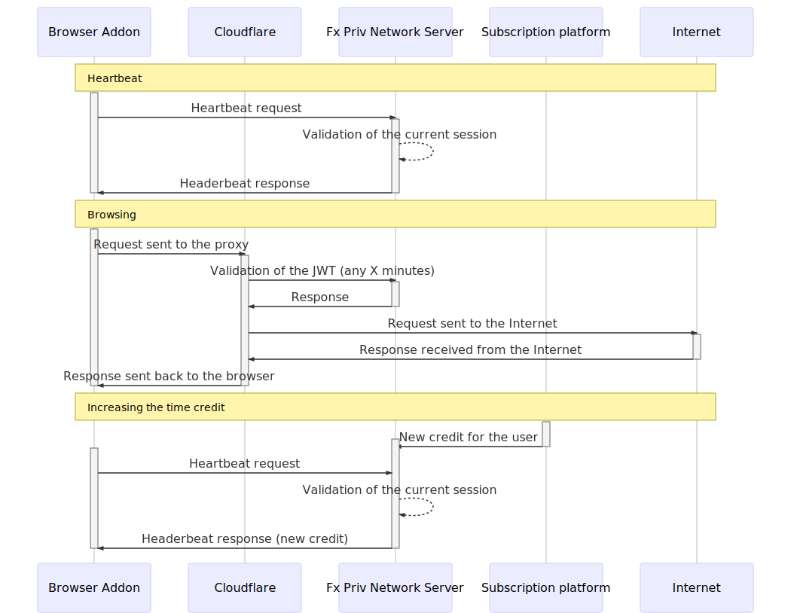

I want to give a quick overview of the new architecture for the secure-proxy phase 2, a.k.a. gas-tank model. There several changes in phase 2, but, engineering-wise, the most interesting ones are: 

- as a secure-proxy user, I have X time credit of proxy usage to consume when I want.
- I can activate/deactivate the proxy at any time, as far as I have enough time credit.
- I can buy more time credit through the FPN subscription web-site.
- Only 1 secure-proxy instance can be active for the same firefox account.

These goals must be achieved without introducing radical changes in the current architecture. In particular, we want to keep the Cloudflare<->Mozilla communication based on JWTs.

# Heartbeat communication between extensions and secure-proxy-service (SPS)

Secure-proxy time consumption should stop when the communication between extension and SPS is interrupted for more than X seconds/minutes. This is needed for several reasons: the laptop can be suspended, the internet connection can drop, the browser can crash, etc. and we don't want to consume the time credit when the user is not actively connected to the proxy.

These heartbeat ping requests are fetched by the extension any X seconds. In the request body, the extension informs about the browser/user/extension state. The server responds with the following data:

- token invalidation and the reason why this happened (a new instance of secure-proxy has been activated by the same FxA account; all the time available consumed; etc).
- the remaining time credit (in case the user adds extra time through the subscription platform)

Timeout handling:
- the server invalidates the current token after X seconds/minutes of
extension inactivity.
- the extension disables the proxy whether the server is unreachable (more likely the user's internet connection is down)

**Complexity**: medium
**Critical aspects**: SPS will receive a high number of requests. This can generate performance issues and high bandwidth consumption.

# Token generation and token invalidation

In the new architecture, JWTs must be generated by the secure-proxy-service  (SPS). This component will be in charge of:

- allow only one single valid JWT per user.
- invalidate the current JWT in case the heartbeat communication is interrupted.
- expose the validity of a JWT (see Cloudflare security section)

**Complexity**: medium/high
**Critical aspects**: coordination with Cloudflare about the use of SPS as a new JWT generator.

# Cloudflare security

SPS needs to expose a REST method to allow token validity checks: Cloudflare needs to check the JWT validity any few minutes in order to avoid abuses. This REST method can be called at any time.

**Complexity**: low, but we need to coordinate with CloudFlare's developers.

# Extra time credit

Subscription platform needs to inform SPS when the user buys extra time credit. The extension will be informed at the next heartbeat ping request.

